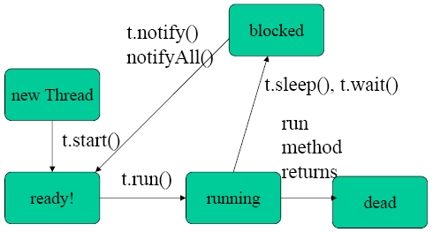

Learning Java
================

Table of contents
=================

<!--ts-->
   * [Collections Framework](#collections-framework)
   * [Serialization](#serialization)
   * [MultiThreading](#multithreading)
   * [DataStructure](#datastructure)

<!--te-->


DataStructure
=============
DataStructure is a way of organizing data in a computer so that it can be used effectively.

There are various types of DataStructure:

* Linear DataStructure:Stack,Queue,LinkedList 

  * All operations are done in Stack,Queue,LinkedList in a sequential manner so these datastructure is called as linear datastructure.

Stack:
------
* perform operations on LIFO(Last In First Out) or FILO(First In LastOut) order.
* Stacks are used to implement functions, parsers, backtracking algorithms. A pile of books, a stack of dinner plates,etc. 
* The basic operating principle is that last item you put in is first item you can take out.
* Stack is used in solving problems works on recursion.

Queue:
------
* perform operations on FIFO(First In First Out) order.
* i.e. the element inserted at first in the list, is the first element to be removed from the list. 
* the insertion and deletion can take place from one end.
* It requires more memory
* Queue is used in solving problems having sequential processing.
* A real-world example of queue can be a printer,election voting.


Circular Queue:
---------------
* a linear data structure in which the last element of the Queue is connected to the first element, thus creating a circle.
* the insertion and deletion can take place from any end.
* It requires less memory.
* It has no specific order for execution.
* A real-world example: Traffic system
* In a computer-control traffic system, Each light of traffic light gets ON one by one after every interval of time. 

  Like red light gets ON for one minute then yellow light for one minute and then green light. After green light, the red light gets ON.

Singly linked list (SLL):
-------------------------
* SLL has nodes with only one data field and next link field.
* traversal can be done using the next node link only.
* occupies less memory than DLL as it has only 2 fields.
Doubly linked list (DLL):
-------------------------
* DLL has nodes with a data field, a previous link field and a next link field.
* traversal can be done using the previous node link or the next node link.
* occupies more memory than SLL as it has 3 fields.
MultiThreading
==============
Multithreading is a process of executing multiple threads simultaneously.

Process
-------
* A program in execution is referred as process.
* A process consists of multiple threads.
* A process has its own address space.

Thread
------
* A thread is a lightweight subprocess.
* Threads share the same address space.
* Threads are independent. 
* If there occurs exception in one thread, it doesn't affect other threads. 
  because it uses a shared memory area.

Life cycle of a Thread
----------------------
The life cycle of the thread in java is controlled by JVM.
 
There are states in thread life cycle in java new, runnable, running, wait, sleep and terminated.

<p align="center">
  
</p>


1. New: 

The thread is in new state if you create an instance of Thread class.

Ex: Thread t= new Thread(); // using new keyword we are creating instance of thread class

2. Runnable: 

The thread is in runnable state after invocation of start() method.

-- means thread is in ready to run state and not in running state.

Ex: t.start(); //calling start() method

3. Running: 

The thread is in running state means the thread scheduler has selected it for an execution.

Ex: void run(){}; // goes to run() method for execution

4. Terminate:

When thread completed its tasks then it will go into terminated or dead state.

5. Blocked:(waiting and sleeping)

When thread call wait() then it will go into blocked state.

Whenever blocked state thread get notify/notifyAll signal it will go into a runnable state.

When thread call sleep() then it will go into blocked state for a specified time.

When that time elapsed it will go again into runnable state.

How to create thread:
---------------------
There are two ways to create a thread:

1. By extending Thread class

-- Thread class extends Object class and implements Runnable interface.

* Java Thread Example by extending Thread class
```
class CreateThread extends Thread{  
	
	public void run(){  
		System.out.println("thread is running...");  
	}  
	
	public static void main(String args[]){  
		CreateThread t1=new CreateThread();  
		t1.start();  
 	}  
}   
```

2. By implementing Runnable interface.

-- The Runnable interface should be implemented by any class.

   But their instance should be executed by a thread.
   
   Runnable interface have only one method named run().
   
*  public void run(): is used to perform action for a thread.

* Java Thread Example by implementing Runnable interface
```
class CreateThread implements Runnable{
  
     public void run(){  
         System.out.println("thread is running...");  
     }  
  
     public static void main(String args[]){  
          CreateThread m1=new CreateThread();  
          Thread t1 =new Thread(m1);  
          t1.start();  
     }  
}  
```

Runnable vs Threads
-------------------
--> When a class is already extended by another class then we can't extend it by Thread class.

--> Because java doesn't support multiple inheritance.

--> But we can implement the Runnable interface while extending another class.
   
--> Each Thread created by the Thread class is associated with new Object.
															
--> whereas Each Thread created by the Runnable interface shares the same Object.


Thread Scheduler in Java
------------------------
It is a part of JVM that decides which thread should be run.
It is a controller of threads.

* Imp points:

--> we cannot start a thread twice.

throws exception IllegalThreadStateException

```
public class ThreadTwice extends Thread{  
 	
 	public void run(){  
   		System.out.println("running...");  
	} 
	 
 	public static void main(String args[]){  
  		ThreadTwice t1=new ThreadTwice();  
  		t1.start();  
  		t1.start();  
	}
}  
 
 o/p:
 running
 Exception in thread "main" java.lang.IllegalThreadStateException
 ```
--> we cannot call run() method directly instead start() method.

because it is not coming from Thread class. So, that method consider as normal run() method
 ```
class CallRun extends Thread{  
 	
 	public void run(){  
   		System.out.println("running...");  
 	}  
 	
 	public static void main(String args[]){  
  		CallRun1 t1=new CallRun1();  
  		t1.run();//fine, but does not start a separate call stack  
 	}  
}  

Output:running...
 ```
 
 Critical Section:
 ----------------
 --> part of a program which accesses a shared resources at the same time is known as critical section.
 
Race Condition:
---------------
--> when multiple threads tries to access a shared resource at the same time, So it gives erroneous result known as race condition. 

--> to avoid this condition and the ways to achieve thread safe execution is as follows:

* by using synchronization (implicit lock)
* by using lock mechanism  (explicit lock)
* Using Semaphore
 
 --> above types are comes under mutex or mutual exclusive.
 
 --> mutual exclusive means it is taking the mutual decision which thread can come in execution at a time.
 

Methods inherited from class java.lang.Object
---------------------------------------------
--> clone, equals, finalize, getClass, hashCode, notify, notifyAll, wait.
 
Synchronization in Java:
------------------------
--> controlling the access of multiple threads to any shared resource.

--> without synchronization RaceConditon will occur.

    see example: multithreading.RaceCondition source code in src folder

The synchronization is mainly used to

1. To prevent thread interference.

2. To prevent consistency problem.

Thread Synchronization:
-----------------------
There are two types of thread synchronization

mutual exclusive and inter-thread communication.

Mutual Exclusive:
-----------------
preventing threads from interfering with one another while sharing data.
 
This can be done by three ways in java:

1. Synchronized method:

Synchronized method is used to lock an object for any shared resource.

When a thread invokes a synchronized method,
it automatically acquires the lock for that object and releases it when the thread completes its task.

 refer example: multithreading.synchronization source code in src folder
 
2. Synchronized block:

Synchronized block can be used to perform synchronization on any specific resource of the method.

Suppose you have 100 lines of code in your method, but you want to synchronize only 8 lines,
you can use synchronized block.

3. static synchronization.


Cooperation (Inter-thread communication in java)
------------------------------------------------
wait(),notify() and notifyAll():

These methods are allowed for inter-thread communication.

Inter-thread communication allowing synchronized threads to communicate with each other.

It is implemented by following methods of Object class:

* wait():

waiting thread goes to blocked state that means it releases the lock and wait until either another thread invokes notify() / notifyAll() method
for this object or a specified amount of time has elapsed.

wait() method should be called from synchronized method only otherwise it will throw exception "IllegalMonitorStateException".

* notify():
wake up signal 

It gives signal to waiting thread and that thread goes to runnable state for execution.

At a time only one thread is chosen to awakened.

* notifyAll():

It is also wake up signal.

It gives signal to all waiting threads and that threads goes to runnable state for execution.

At a time all waited threads are chosen to awakened. 

Locking Mechanism:
------------------
Locking mechanism is similar to synchronization.

Ex: using lock.lock();  //lock acquired
    ........
    ........
    
    lock.unlock();     // lock releases
    
We can achieve synchronization by using locking mechanism also provided with some new features.

Main difference between synchronization and Lock API is that fairness property.

fairness property means giving 1st priority to access longest waiting thread to the lock. 
  
But in synchronization there is no guarantee which waiting thread will get 1st access.

Lock API
--------
* void lock()
* void lockInterruptibly() 
* boolean tryLock() 
* boolean tryLock(long timeout, TimeUnit timeUnit)
* void unlock()

Lock Implementations
--------------------
* using ReentrantLock

* ReentrantReadWriteLock

* StampedLock

Working With Conditions
-----------------------
Traditionally Java provides wait(), notify() and notifyAll() methods for thread intercommunication. 

Conditions have similar mechanisms, but in addition, we can specify multiple conditions.

wait(), notify() and notifyAll() instead of these await(),signal(),signalAll() are used.

Semaphore in Java:
------------------
Semaphore is a variable use for synchronization process.

But it limits the number of threads to access a shared resource concurrently at a time.

Basically it sets the limit of the threads.

if number count > 0 then allowed to access.

if number count <= 0 then denied to access.(negative no. not allowed)

Ex: If we set a semaphore limit 4.

Semaphore semaphore = new Semaphore(4);

then it allows only 4 threads to access shared resource concurrently at a time.

by using semaphore.acquire(); 

it acquires the lock and count will decrease by 1 

And it releases the lock by using

semaphore.release(); 

Then count will increase by 1

Thread Pool in Java
-------------------
--> Thread Pool means a collection of idle threads that are used when required to execute tasks.

--> Need of Thread Pool: 
   
* to limits the number of threads
    
* to reuse the threads 


    
    
Collections Framework
===================

**Java Collections Framework -heirarchy-- relationship between various api **

Iterator
--------
root interface , used to iterate to forward direction.
hasNext()
next()
remove()
through Iterable method we get the reference of hasNext & next


List (Interface)
----
* Stores elements in indexed approach
* can add duplicate elements (supports redundancy)

* ArryList (Class)
    * ArrayList is implemented as a resizable or growable array.
    * As more elements are added to ArrayList, its size is increased dynamically.
    * default capacity = 10 and increaseing capacity = (current capacity * 3/2)+1.
    * It's elements can be accessed directly by using the get and set methods, since ArrayList is essentially an array.
    * duplicates,heterogeneous and null objects are allowed.
    * Worst choice for inserting/deleting in middle of ArrayList. Because several shift operation required.
    * Insertion order is preserved.
    * non-synchronized.
     
    
* LinkedlList (Class)
    * LinkedList is implemented as a double linked list.
    * Insertion order is preserved. 
    * non-synchronized.
    * duplicates,heterogeneous and null objects are allowed.
    * Its performance on add and remove is better than ArrayList, but worse on get and set methods. 
    * Single vs double linked list 
         * Single - Used for stack
         * Double Linked List -  implement stacks as well as heaps and binary trees.
    * for retrieval ArrayList is better.


* Vector (Class)
    * similar to ArrayList , but vector is synchronized.

* Queue (Interface)
    * Will sort the data
    * front will point to last element 
    * rear will be point to first element which get added
    * In Priority queue- data will get sorted. and front will point least number
    * peeking - obtaining head of queue 
    * polling - removing head of queue


* Set (Interface)
    * data is unique, data is unordered due to hashing
    * data is being added is not indexed
    * basically we get the hashCode of which we added

**Performance of tree set slower since it takes time for sorting the data.**
